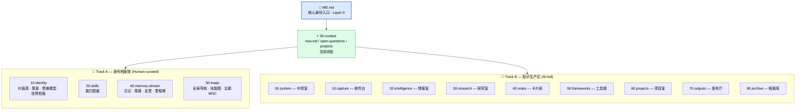
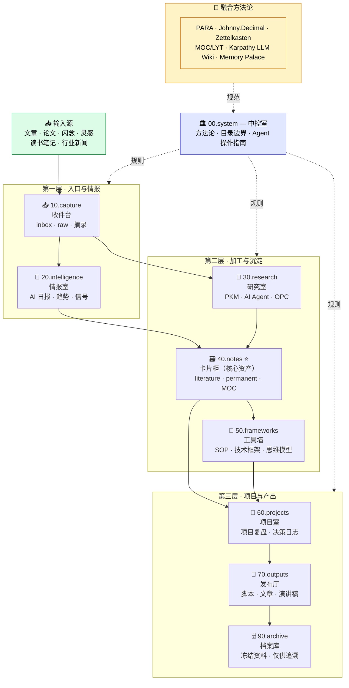

# Personal API

> **Turn your Obsidian vault into an AI identity layer.** Any AI agent reads `ME.md` + `AGENT.md` and instantly knows who you are, how you think, and how to work with you — built on Knowledge Palace v2 (PARA + Johnny.Decimal + Zettelkasten + MOC + LLM Wiki + Memory Palace).

[](./SKILL.md)
[](./LICENSE)
[](#)
[](#)
[](#)

---

## Why

Every new chat, every new project, every new AI tool — you start from zero. You re-explain your tech stack, your communication style, your preferences. Personal API ends that loop:

- **`ME.md`** — your single-page identity contract
- **`AGENT.md`** — your behavior contract
- **A vault navigation layer** — for when AI needs depth

Read `ME.md` once → AI is calibrated for the entire session.

> **Agent-agnostic by design.** This is a folder convention plus two markdown contracts. It doesn't depend on any specific AI runtime — Claude Code, Codex, Cursor, ChatGPT, Gemini, or your custom agent all read the same files the same way.

---

## Quick Start

```bash
# 1. Set your vault path
export OBSIDIAN_VAULT_PATH="/path/to/your/vault"

# 2. Run the scaffolder (full Knowledge Palace v2 structure)
bash scripts/setup.sh

# 3. Open your vault and fill in the [PLACEHOLDER]s
```

Want a lighter footprint? Use `bash scripts/setup.sh --minimal` — only creates the identity layer, skips the `30.knowledge/` tree.

---

## What You Get

| File | Role |
|---|---|
| `templates/ME.md` | Identity contract — your "About Me" page for AI |
| `templates/AGENT.md` | Behavior contract — language, tone, output format, tool rules |
| `templates/methodology.md` | Knowledge management operating manual (placed at `30.knowledge/00.system/`) |
| `scripts/setup.sh` | One-command vault scaffolder (full or `--minimal`) |
| `SKILL.md` | Skill manifest with metadata, examples, use cases |

---

## Architecture

### 1. Vault overall structure (dual-track)

`ME.md` is the entry point. The vault splits into two tracks: **Track A — Identity Archive** (human-curated, read-only for AI) and **Track B — Knowledge Production** (AI-led with human review).



> **The contract:** Identity is yours (Track A is read-only for AI). Knowledge production scales with AI (Track B is fair game for AI to compile, link, archive).

### 2. Knowledge Palace v2 — knowledge flow

The Knowledge Production track is a lifecycle pipeline. Material flows in from the left, gets routed through rooms based on its current life stage, and exits as an output or archive.



> **Core formula:** Folders solve **lifecycle**. MOCs solve **topic membership**. Wikilinks solve **relationships**.
>
> Lifecycle: `capture → intelligence/research → notes → frameworks/projects → outputs → archive`

---

## Use Cases

- **New project onboarding** — drop AI into a fresh repo, it reads `ME.md` and matches your style immediately
- **Cross-tool consistency** — Claude Code, Codex, Cursor, ChatGPT, Gemini all use the same identity contract
- **Persistent context** — stop re-explaining your preferences every session
- **Identity-grounded outputs** — AI writes/decides in your voice, not generic boilerplate
- **Knowledge-grounded decisions** — AI references your accumulated notes instead of hallucinating

---

## Methodology

Personal API is the entry point to a knowledge architecture that fuses six well-established methodologies:

| Method | Contribution |
|---|---|
| PARA (Tiago Forte) | Lifecycle-based directory layout |
| Johnny.Decimal | Numbered prefixes for stable locations |
| Zettelkasten (Luhmann) | Atomic permanent notes |
| MOC / LYT (Nick Milo) | Semantic maps over deep folders |
| LLM Wiki (Karpathy) | Strict raw vs compiled separation |
| Memory Palace | Spatial metaphor for low-cost lookup |

See [`SKILL.md`](./SKILL.md) for the full architecture, AI operation boundaries, frontmatter spec, FAQ, and maintenance routines.

---

## Agent Compatibility

Tested with:

- **Claude Code** — auto-loads `CLAUDE.md` at vault root for hard rules
- **Codex / OpenAI Agents** — auto-loads `AGENTS.md` at vault root
- **Cursor** — point its rules at `ME.md` + `AGENT.md`
- **ChatGPT / Gemini / Custom LLM** — paste the standard prompt: `"Read ME.md and AGENT.md to understand my context."`

The protocol is just markdown. Any agent that can read files can use this skill.

---

## Privacy

Your filled-in `ME.md` and `AGENT.md` contain personal context. **Do not commit them to public repositories.** A `.gitignore` is included to help. This skill ships only templates — never your data.

---

## Related

- `personal-knowledge-vault` — cross-project entry skill that pulls context from this vault
- `knowledge-palace-builder` — full step-by-step vault construction guide

---

## Credits

Designed and battle-tested daily by [@beiyuii](https://github.com/beiyuii).
Methodology synthesizes work from Tiago Forte, Niklas Luhmann, Nick Milo, Andrej Karpathy, and Johnny Decimal.

License: MIT.
